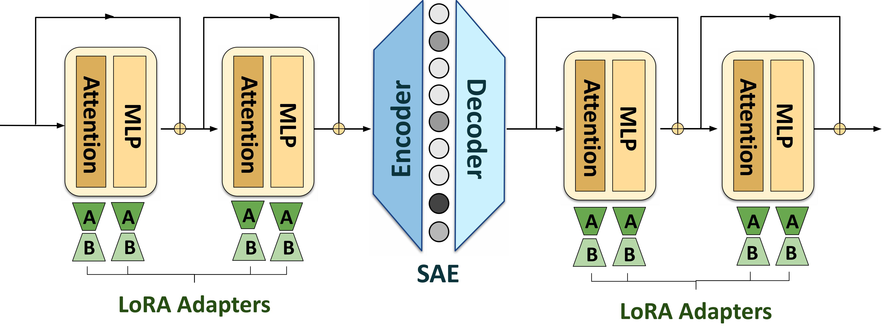

# LoRA-Models-for-SAEs
This is the github repo for our paper ["Low Rank Adapting Models for Sparse Autoencoder Features"](https://arxiv.org/abs/2501.19406v1).

## Reproducing Experiments
Below are instructions to reproduce experiments in the paper (aspirationally).
First pip install the required python packages
```
torch datasets transformers simple-parsing einops natsort accelerate bitsandbytes python-dotenv wandb peft sae-lens tabulate openai lm-eval
```

### Training SAEs
To train TopK Gemma and Llama SAEs used in the paper, run the following commands.
```
python train_sae.py --device 0 --model_type "gemma" --layer 12 --num_train_tokens 2_000_000_000
python train_sae.py --device 0 --model_type "llama" --layer 12 --num_train_tokens 4_000_000_000
```
These will save SAE checkpoints in `saved_saes/` to use for other experiments. To train e2e SAEs, add a `--e2e` flag to the previous commands.

### Low Rank Adapting for your SAE
To train LoRA models for SAEs, use `train_lora.py` with the following arguments:

Required arguments:
- `--device`: CUDA device index to run training on
- `--model_type`: Type of base model ("gemma" or "llama")
- `--rank`: Rank of the LoRA adaptation
- `--num_train_examples`: Number of training examples (choose from 15000, 30000, or 100000)

Optional arguments:
- `--sae_layer`: Which SAE layer to use (default: 12)
- `--LoRA_layers`: Which layers to apply LoRA to ("all" or "after", default: "all")
- `--save_model`: Include this flag to save the adapter weights after training

To reproduce the timing experiment in the paper, run the following command
```
python train_lora.py --device 0 --model_type "gemma" --sae_layer 12 --rank 64 --num_train_examples 15000 --save_model
```
Data for training time and validation loss will be saved in `data/TopK/`. The saved adapter weights will be saved in `saved_models/`.

### Running Evals
#### SAEBench
To run SAEBench, first run `python eval/SAE-Bench/get_peft_dict.py` to get the adapter weights for the LoRA models. Then, run
```
python eval/SAE-Bench/run_eval.py --device 0 --model_type "peft"
python eval/SAE-Bench/run_eval.py --device 0 --model_type "base"
```
to get the results for the LoRA and base models.

#### Steering
To run steering evals, first make positive examples for your chosen SAE feature by choosing a neuron and providing a feature description + few examples when running 
```
python eval/steering/make_positive_examples.py --device 0 --neuron [neuron_id]
```
Then, to hyperparameter tune $\alpha$, run
```
python eval/steering/tune_alpha.py --device 0 --neuron [neuron_id] --tuning --alpha [alpha_value]
```
Once tuned, evaluate on the test set by running
```
python eval/steering/run_eval.py --device 0 --neuron [neuron_id] --alpha [alpha_value]
```

#### NLP Benchmarks
To evaluate models on NLP benchmarks (MMLU, HellaSwag, TruthfulQA), run:
Required arguments:
- `--device`: CUDA device index to run evaluation on
- `--model_type`: Type of model to evaluate ("peft" or "base")
- `--model_size`: Size of the base model in billions of parameters (2 or 9)

Optional arguments:
- `--sae`: Include this flag to evaluate models with SAE features

For example, to evaluate a 2B parameter base model without SAE, run:
```
python eval/benchmarks/run_benchmarks.py --device 0 --model_type "base" --model_size 2
```
To evaluate a 9B parameter model with the SAE inserted, run:
```
python eval/benchmarks/run_benchmarks.py --device 0 --model_type "peft" --model_size 9 --sae
```

### Creating Plots
Follow and run the appropriate cells in `plot.ipynb` to reproduce the plots in the paper. Resulting plots will be saved in `plots/`.

